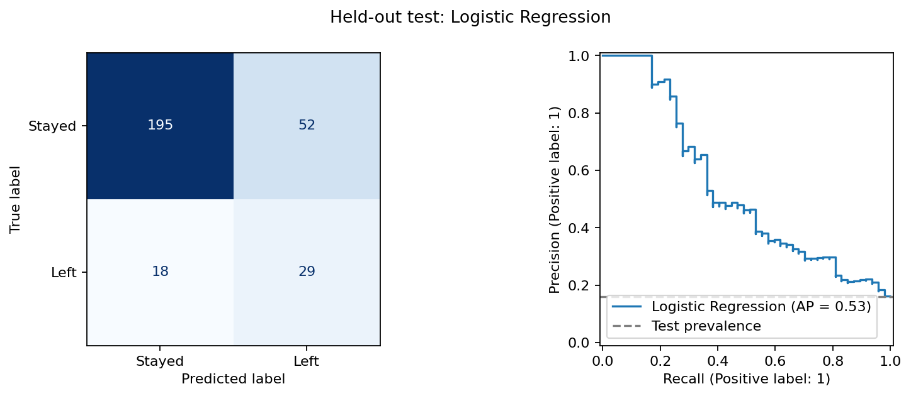

# First experiment: results and interpretation

Recorded 16 September 2026. These are measured results, not target scores.

## Dataset and split

The CSV has 1,470 rows, 35 columns, no missing cells and no exact duplicate rows. There are 237 records labelled left (16.12%) and 1,233 labelled stayed. The stratified split uses 1,176 training records (190 left) and 294 test records (47 left).

## Model selection: training data only

Five-fold stratified cross-validation; seed 42. Selection criterion fixed in advance: highest mean average precision (AP).

| Model | Mean AP | AP standard deviation | Mean F1 | Mean recall | Mean accuracy |
|---|---:|---:|---:|---:|---:|
| Logistic Regression | 0.605 | 0.082 | 0.499 | 0.737 | 0.761 |
| Random Forest | 0.569 | 0.048 | 0.424 | 0.332 | 0.858 |
| Decision Tree | 0.357 | 0.052 | 0.357 | 0.516 | 0.701 |
| Majority baseline | 0.162 | 0.000 | 0.000 | 0.000 | 0.838 |

Logistic Regression was selected on this criterion. The difference in AP is not established as statistically significant; do not claim it is universally better than Random Forest. Fold standard deviations are not confidence intervals.

## Held-out test results

The selected model and predefined baseline were evaluated at threshold 0.5. The other candidates were not selected using test scores.

| Metric | Majority baseline | Logistic Regression |
|---|---:|---:|
| Accuracy | 84.0% | 76.2% |
| Precision for left | 0.0%* | 35.8% |
| Recall for left | 0.0% | 61.7% |
| F1 for left | 0.000 | 0.453 |
| ROC-AUC | 0.500 | 0.776 |
| Average precision | 0.160 | 0.533 |

*The baseline makes no positive predictions, so precision is undefined mathematically and reported as zero by convention.*

The selected model identified **29 of the 47 actual leavers**, missed 18 and incorrectly flagged 52 of the 247 employees who stayed. It correctly classified 195 stayers. Its lower accuracy than the baseline comes with detection of leavers, which the baseline misses entirely. The false-positive count is substantial, and this is a starting academic result rather than a deployable system.

## How to describe the project

“I compared three classifiers with a majority baseline for employee attrition. I kept preprocessing inside cross-validation to avoid leakage and selected Logistic Regression using training average precision. On the held-out test set it detected 29 of 47 leavers, with 35.8% precision and 61.7% recall. This shows why accuracy alone is misleading: the majority baseline achieved 84% accuracy while detecting no leavers.”

Use this explanation only after understanding and being able to reproduce the code; implementation was prepared with Codex assistance.

## Limitations and next experiments

This is a small educational dataset, with no prediction horizon or external validation. The single holdout result is uncertain. No causal conclusions, calibration claims or fairness claims are supported. Class weighting changes training emphasis, and the output scores should not be described as validated individual resignation probabilities.

Future changes could compare a threshold selected using training validation, add nested hyperparameter tuning and evaluate calibration. Do not tune against the reported test metrics. This test set has now been inspected, so disclose its reuse in later experiments.

Detailed values, software versions, source hash and split indices are saved under `results/`. A library compatibility warning about the unused SciPy `iprint` solver option was emitted during this run; training completed without a convergence warning.
